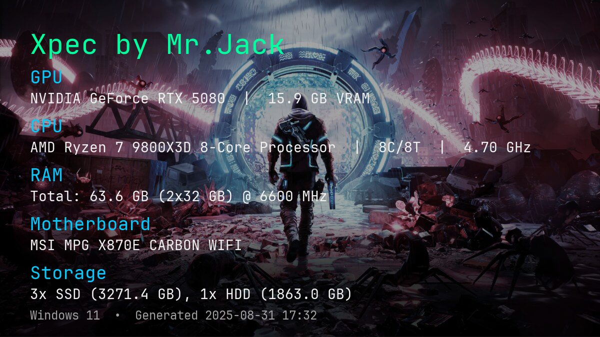

# Xpec by Mr.Jack



A small tool to collect and display your PC specs in a clean HTML page and an optional shareable PNG image.

- CPU, RAM modules, GPU(s) with VRAM
- Storage with SSD/HDD detection (uses MSFT_PhysicalDisk when available; NVMe heuristic fallback)
- Configurable title, background image, colors, and fonts via [xpec.config.json](xpec.config.json)

## Precompiled version

You can find a precompiled version in [demo](https://hackers.army/xpec/xpec.rar).

---

## Requirements

- Windows 10/11 recommended
- Python 3.8+ (64-bit recommended)
- Dependencies are listed in [requirements.txt](requirements.txt):
  - psutil, Pillow, comtypes, pynvml, wmi

Linux is partially supported (uses `dmidecode`, `lspci`, `lsblk` if present), but the primary target is Windows.

---

## Quick start (Windows, with venv)

1) Create and activate a virtual environment:
```cmd
py -3 -m venv .venv
.venv\Scripts\activate
```

2) Upgrade pip and install dependencies:
```cmd
python -m pip install --upgrade pip
pip install -r requirements.txt
```

Run the app:
```cmd
python xpec.py
```

This generates **pc_specs.html** (opened automatically) and, if possible, **pc_specs.png** in the same folder.

## Build a standalone .exe (Windows)
Install PyInstaller:
```cmd
pip install pyinstaller
```

Build:
```cmd
pyinstaller --onefile --noconsole xpec.py
```

Run:

The executable will be in **dist\xpec.exe**.

To customize, place **xpec.config.json** and any assets (e.g., bg.jpg, fonts) next to xpec.exe.
If no config is found, a default xpec.config.json is auto-created next to the executable on first run.

### Optional (bundle assets inside the exe):

```cmd
pyinstaller --onefile --noconsole ^
  --add-data "bg.jpg;." ^
  --add-data "xpec.config.json;." ^
  xpec.py
```

Note: Keeping 
xpec.config.json
 and images next to the exe is simpler for updates.

## Configuration
The app looks for **xpec.config.json**:

When packaged: next to xpec.exe (preferred), then current working directory.
When running from source: next to xpec.py, then current working directory.
If not found, a default config is written next to the executable/script.

Minimal example:

```json
{
  "title": "Xpec by Mr.Jack",
  "background_image": "bg.jpg",
  "background_fit": "cover",
  "background_overlay": { "color": [0, 0, 0], "opacity": 0.0 }
}
```
Other keys you can adjust:

image_size, background_color, accent_color, sub_color, text_color, dim_color
font_paths (title, h2, body, small). If empty on Windows, it falls back to Arial.
Place images/fonts in the same folder or use absolute paths.


## Tips and troubleshooting
NVIDIA VRAM: pynvml enables accurate VRAM detection. If VRAM shows N/A, update NVIDIA drivers.

Storage type: Prefers MSFT_PhysicalDisk.MediaType; otherwise uses NVMe heuristics for SSD.

Debug output:
- Set XPEC_DEBUG=1 for motherboard detection details.
- Set XPEC_DEBUG_GPU=1 for GPU source matching details.

If imports fail, ensure you’re inside the activated venv and pip install -r requirements.txt succeeded.

## License
MIT (or your preferred license)